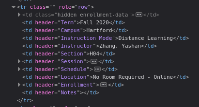
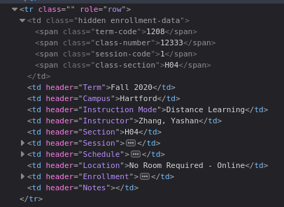

# Husky


Husky is a TypeScript library that contains several useful utilities for interfacing with UConn services.

## Installation

Use npm to install Husky.

```bash
npm install @ilefa/husky
```

Since Husky is currently hosted on GitHub packages, you will need to make a ``.npmrc`` file in the root of your project, and insert the following:

```env
@ilefa:registry=https://npm.pkg.github.com
```

## Usage

```ts
import {
    getRawEnrollment,
    getRmpReport,
    getServiceStatus
    searchBySection,
    searchCourse,
    searchRMP,
    SearchParts,
    UConnService
} from '@ilefa/husky';

// Lookup a course by it's name, and optionally it's campus
let course = await searchCourse('CSE2050', 'storrs');

// Lookup a course by it's name, using the provided local mappings
let course = await searchCourse('CSE2050', 'storrs', true)

// Lookup a course by it's name, and only retrieve certain parts
let course = await searchCourse('CSE2050', 'storrs', false, [SearchParts.SECTIONS]);

// Lookup a section by the course name and section identifier
let section = await searchBySection('CSE2050', '021L');

// Lookup a professor (via RateMyProfessors)
let prof = await searchRMP('Jacob Scoggin');

// Retrieve a professor report (via RateMyProfessors)
let report = await getRmpReport('2525133');

// Lookup a course's raw enrollment data using it's internal course number
let enrollment = await getRawEnrollment('1218', '13767', '021L');

// Retrieve current UConn service statuses (all of them, or specify some to return)
let statuses = await getServiceStatus();
let statuses = await getServiceStatus(UConnService.HUSKYCT, UConnService.STUDENT_ADMIN);
```

## Heads up

If you plan to utilize any of the mappings files directly in a TypeScript project, you will need to specify the ``resolveJsonModule`` option as ``true`` in the compiler options of your ``tsconfig.json`` file.

If you do not, you may have a problem importing the JSON file directly.

## Course Mappings
Husky offers a complete static set of "course mappings" aka course information from the course catalog.

The data stored in the course mappings JSON file is sorted alphabetically by course name (ABCD1234Q),
and is wrapped in an array. It can be can be imported via ``@ilefa/husky/courses.json``:

```ts
import CourseMappings from '@ilefa/husky/courses.json';

// For example, retrieving GEOG1700 will yield the following data:
let geog1700 = CourseMappings.find(course => course.name === 'GEOG1700');

{
    "name": "GEOG1700",
    "catalogName": "World Regional Geography",
    "catalogNumber": "1700",
    "prerequisites": "RHAG students cannot take more than 22 credits of 1000 level courses",
    "attributes": {
        "lab": false,
        "writing": false,
        "quantitative": false,
        "environmental": false,
        "contentAreas": [
            "CA2",
            "CA4INT"
        ]
    },
    "credits": 3,
    "grading": "Graded",
    "description": "Study of geographic relationships among natural and cultural environments that help to distinguish one part of the world from another. Analysis of selected countries as well as larger regions, with specific reference to the non-western world. CA 2. CA 4-INT."
}
```

## Classroom Mappings
Husky also offers a complete static set of "classroom mappings" aka classroom information from the [classroom viewer website](https://classrooms.uconn.edu/classroom/).

The data stored in the classroom mappings JSON file is sorted alphabetically by room name (BLDG1234),
and is wrapped in an array. It can be can be imported via ``@ilefa/husky/classrooms.json``:

```ts
import ClassroomMappings from '@ilefa/husky/classrooms.json';

// For example, retrieving ARJ105 will yield the following data:
let arj105 = ClassroomMappings.find(room => room.name === 'ARJ105');

{
    "name": "ARJ105",
    "building": {
        "name": "Arjona",
        "code": "ARJ"
    },
    "room": "105",
    "techType": "FULL",
    "techDescription": "",
    "seatingType": "FIXED_AUDITORIUM",
    "boardType": "WHITEBOARD",
    "capacity": {
        "covid": 42,
        "full": 226
    },
    "byodTesting": true,
    "airConditioned": false,
    "videoConference": {
        "name": "Teach From Video Conference",
        "attributes": {
            "shareContent": true,
            "instructorFacingCamera": true,
            "studentFacingCamera": false,
            "presentMediaFrontOfRoom": false,
            "presentMediaBackOfRoom": true,
            "instructorMicrophone": true,
            "studentMicrophone": false,
            "connectToWebex": true
        }
    },
    "lectureCapture": "ALL",
    "liveStreamUrl": "http://www.kaltura.com/tiny/rw5g6",
    "threeSixtyView": "https://live.staticflickr.com/65535/47864045151_3b4af52c27_o_d.jpg"
}
```

In the case that classrooms are updated, added, or removed over time, you may execute ``npm run classrooms`` to regenerate the mappings.

## RMP Mappings
Husky also offers a complete static set of mappings for RateMyProfessors IDs for all UConn campuses and professors.

The data is stored in the RMP mappings file, and sorted alphabetically by professor name in the form of an array.
It can either be queried by using the [searchRMP](index.ts#L437) function, or directly by importing ``@ilefa/husky/rmpIds.json``.

Also, do note that the functionality of the [searchRMP](index.ts#L437) function has been changed - now, it will search for RMP IDs locally, and then falls back to creating a request to RMP if the data is not found locally.

Regardless of how this data is queried, it will return a payload in the form of a [RateMyProfessorResponse](index.ts#L85). Additionally, we have all of the campus IDs stored in the [RmpCampusIds](index.ts#L149) enum in case you need them for anything.

## Manually finding internal course information
*Please note this information is included for your convience within the [searchCourse](index.ts#L144) response under [SectionData#internal](index.ts#L51)*

1. Visit the [UConn Course Catalog](https://catalog.uconn.edu/directory-of-courses/), and find the course you want.

2. Next, open your browser's DOM inspector. This can typically be done by right clicking anywhere on the page, and then clicking *Inspect Element*.

3. Once the inspector is open, find the *Element Picker* button, which is usually found in the top-left of the inspector window. It will have a tooltip that says something along the lines of "Select an element from the page to inspect it."

4. Now, once you click back to the page, you should see that when you hover over elements on the page, they become highlighted. Scroll down to the specific course entry that you would like to track, and click on any of the boxes for that row.

5. Once you click on it, you should see something like this: 



6. From here, expand the top ``<td>`` element, and you will be able to see the course data. It should look like this: 



## Contributing
Pull requests are welcome. For major changes, please open an issue first to discuss what you would like to change.

Please make sure to update tests as appropriate.

## License
[GPL-3.0](https://choosealicense.com/licenses/gpl-3.0/)